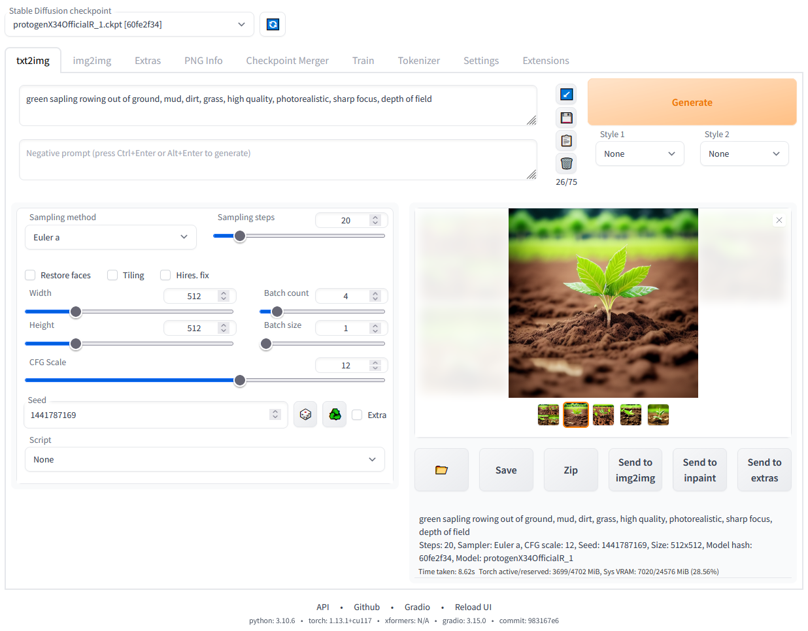

# Stable Diffusion 웹 UI
Gradio 라이브러리를 사용하여 구현된 Stable Diffusion의 웹 인터페이스입니다.



## 기능
[이미지와 함께 자세한 기능 소개](https://github.com/AUTOMATIC1111/stable-diffusion-webui/wiki/Features):
- 원본 txt2img 및 img2img 모드
- 한 번의 클릭으로 설치 및 실행 스크립트 (단, Python과 git은 별도로 설치 필요)
- 아웃페인팅
- 인페인팅
- 컬러 스케치
- 프롬프트 매트릭스
- Stable Diffusion 업스케일
- 주의력 조절, 모델이 더 주의를 기울여야 하는 텍스트 부분 지정
    - `((정장))`을 입은 남자 - 정장에 더 주의를 기울임
    - `(정장:1.21)`을 입은 남자 - 대체 구문
    - 텍스트를 선택하고 `Ctrl+Up` 또는 `Ctrl+Down` (MacOS에서는 `Command+Up` 또는 `Command+Down`)을 눌러 선택한 텍스트의 주의력을 자동으로 조정 (익명 사용자가 기여한 코드)
- 루프백, img2img 처리를 여러 번 실행
- X/Y/Z 플롯, 다양한 매개변수로 3차원 이미지 플롯을 그리는 방법
- 텍스트 인버전
    - 원하는 만큼 임베딩을 가질 수 있고 원하는 이름을 사용할 수 있음
    - 토큰당 다른 수의 벡터를 가진 여러 임베딩을 사용할 수 있음
    - 반정밀도 부동 소수점 숫자로 작동
    - 8GB에서 임베딩 학습 (6GB에서도 작동하는 보고 있음)
- 추가 기능 탭:
    - GFPGAN, 얼굴을 수정하는 신경망
    - CodeFormer, GFPGAN의 대안으로 사용할 수 있는 얼굴 복원 도구
    - RealESRGAN, 신경망 업스케일러
    - ESRGAN, 많은 타사 모델이 있는 신경망 업스케일러
    - SwinIR 및 Swin2SR ([여기 참조](https://github.com/AUTOMATIC1111/stable-diffusion-webui/pull/2092)), 신경망 업스케일러
    - LDSR, 잠재적 확산 초해상도 업스케일링
- 종횡비 조정 옵션
- 샘플링 방법 선택
    - 샘플러 eta 값 조정 (노이즈 승수)
    - 더 고급 노이즈 설정 옵션
- 언제든지 처리 중단 가능
- 4GB 비디오 카드 지원 (2GB에서도 작동하는 보고 있음)
- 배치에 대한 올바른 시드
- 실시간 프롬프트 토큰 길이 검증
- 생성 매개변수
     - 이미지 생성에 사용한 매개변수가 해당 이미지와 함께 저장됨
     - PNG는 PNG 청크에, JPEG는 EXIF에 저장
     - 이미지를 PNG 정보 탭으로 드래그하여 생성 매개변수를 복원하고 자동으로 UI에 복사 가능
     - 설정에서 비활성화 가능
     - 이미지/텍스트 매개변수를 프롬프트 상자로 드래그 앤 드롭
- 생성 매개변수 읽기 버튼, 프롬프트 상자의 매개변수를 UI에 로드
- 설정 페이지
- UI에서 임의의 Python 코드 실행 (`--allow-code`로 실행해야 활성화)
- 대부분의 UI 요소에 마우스 오버 힌트
- 텍스트 설정을 통해 UI 요소의 기본값/최소값/최대값/단계 값을 변경 가능
- 타일링 지원, 텍스처처럼 타일링할 수 있는 이미지를 생성하는 체크박스
- 진행 막대 및 실시간 이미지 생성 미리보기
    - 거의 VRAM이나 컴퓨팅 요구사항 없이 미리보기를 생성하기 위해 별도의 신경망 사용 가능
- 네거티브 프롬프트, 생성된 이미지에서 보지 않기를 원하는 것을 나열할 수 있는 추가 텍스트 필드
- 스타일, 프롬프트의 일부를 저장하고 나중에 드롭다운을 통해 쉽게 적용하는 방법
- 변형, 같은 이미지를 약간의 차이로 생성하는 방법
- 시드 크기 조정, 약간 다른 해상도로 같은 이미지를 생성하는 방법
- CLIP 인터로게이터, 이미지에서 프롬프트를 추측하려고 시도하는 버튼
- 프롬프트 편집, 생성 중간에 프롬프트를 변경하는 방법 (예: 수박을 만들다가 중간에 애니메이션 소녀로 전환)
- 배치 처리, img2img를 사용하여 파일 그룹 처리
- Img2img 대안, 교차 주의 제어의 역 오일러 방법
- 고해상도 수정, 일반적인 왜곡 없이 한 번의 클릭으로 고해상도 사진을 생성하는 편리한 옵션
- 체크포인트 즉시 다시 로드
- 체크포인트 병합기, 최대 3개의 체크포인트를 하나로 병합할 수 있는 탭
- 커뮤니티의 많은 확장 기능이 있는 [사용자 정의 스크립트](https://github.com/AUTOMATIC1111/stable-diffusion-webui/wiki/Custom-Scripts)
- [Composable-Diffusion](https://energy-based-model.github.io/Compositional-Visual-Generation-with-Composable-Diffusion-Models/), 여러 프롬프트를 한 번에 사용하는 방법
     - 대문자 `AND`를 사용하여 프롬프트 분리
     - 프롬프트에 대한 가중치도 지원: `고양이 :1.2 AND 개 AND 펭귄 :2.2`
- 프롬프트에 대한 토큰 제한 없음 (원본 stable diffusion은 최대 75개의 토큰 사용 가능)
- DeepDanbooru 통합, 애니메이션 프롬프트를 위한 danbooru 스타일 태그 생성
- [xformers](https://github.com/AUTOMATIC1111/stable-diffusion-webui/wiki/Xformers), 선택한 카드에 대한 주요 속도 증가: (명령줄 인수에 `--xformers` 추가)
- 확장 기능을 통한 [히스토리 탭](https://github.com/yfszzx/stable-diffusion-webui-images-browser): UI 내에서 이미지를 편리하게 보고, 직접하고, 삭제
- 영원히 생성 옵션
- 학습 탭
     - 하이퍼네트워크 및 임베딩 옵션
     - 이미지 전처리: 자르기, 미러링, BLIP 또는 deepdanbooru를 사용한 자동 태깅 (애니메이션용)
- 클립 스킵
- 하이퍼네트워크
- Loras (하이퍼네트워크와 비슷하지만 더 예쁨)
- 미리보기와 함께 임베딩, 하이퍼네트워크 또는 Loras를 선택하여 프롬프트에 추가할 수 있는 별도의 UI
- 설정 화면에서 다른 VAE를 선택하여 로드 가능
- 진행 막대에 예상 완료 시간
- API
- RunwayML의 전용 [인페인팅 모델](https://github.com/runwayml/stable-diffusion#inpainting-with-stable-diffusion) 지원
- 확장 기능을 통한 [Aesthetic Gradients](https://github.com/AUTOMATIC1111/stable-diffusion-webui-aesthetic-gradients), clip 이미지 임베딩을 사용하여 특정 미학으로 이미지를 생성하는 방법 ([https://github.com/vicgalle/stable-diffusion-aesthetic-gradients](https://github.com/vicgalle/stable-diffusion-aesthetic-gradients) 구현)
- [Stable Diffusion 2.0](https://github.com/Stability-AI/stablediffusion) 지원 - [위키](https://github.com/AUTOMATIC1111/stable-diffusion-webui/wiki/Features#stable-diffusion-20)에서 지침 참조
- [Alt-Diffusion](https://arxiv.org/abs/2211.06679) 지원 - [위키](https://github.com/AUTOMATIC1111/stable-diffusion-webui/wiki/Features#alt-diffusion)에서 지침 참조
- 이제 나쁜 글자가 없음!
- safetensors 형식으로 체크포인트 로드
- 해상도 제한 완화: 생성된 이미지의 크기는 64가 아닌 8의 배수여야 함
- 이제 라이선스가 있음!
- 설정 화면에서 UI 요소 순서 변경
- [Segmind Stable Diffusion](https://huggingface.co/segmind/SSD-1B) 지원

## 설치 및 실행
필요한 [의존성](https://github.com/AUTOMATIC1111/stable-diffusion-webui/wiki/Dependencies)이 충족되었는지 확인하고 다음 지침을 따르세요:
- [NVidia](https://github.com/AUTOMATIC1111/stable-diffusion-webui/wiki/Install-and-Run-on-NVidia-GPUs) (권장)
- [AMD](https://github.com/AUTOMATIC1111/stable-diffusion-webui/wiki/Install-and-Run-on-AMD-GPUs) GPU
- [Intel CPU, Intel GPU (통합 및 개별)](https://github.com/openvinotoolkit/stable-diffusion-webui/wiki/Installation-on-Intel-Silicon) (외부 위키 페이지)
- [Ascend NPU](https://github.com/wangshuai09/stable-diffusion-webui/wiki/Install-and-run-on-Ascend-NPUs) (외부 위키 페이지)

또는 온라인 서비스 사용 (Google Colab 등):

- [온라인 서비스 목록](https://github.com/AUTOMATIC1111/stable-diffusion-webui/wiki/Online-Services)

### NVidia-GPU를 사용하는 Windows 10/11에서 릴리스 패키지로 설치
1. [v1.0.0-pre](https://github.com/AUTOMATIC1111/stable-diffusion-webui/releases/tag/v1.0.0-pre)에서 `sd.webui.zip`을 다운로드하고 내용을 추출합니다.
2. `update.bat`를 실행합니다.
3. `run.bat`를 실행합니다.
> 자세한 내용은 [Install-and-Run-on-NVidia-GPUs](https://github.com/AUTOMATIC1111/stable-diffusion-webui/wiki/Install-and-Run-on-NVidia-GPUs) 참조

### Windows에서 자동 설치
1. [Python 3.10.6](https://www.python.org/downloads/release/python-3106/)을 설치하고 "Add Python to PATH"를 체크합니다.
2. [git](https://git-scm.com/download/win)을 설치합니다.
3. stable-diffusion-webui 저장소를 다운로드합니다. 예를 들어 `git clone https://github.com/AUTOMATIC1111/stable-diffusion-webui.git`을 실행합니다.
4. Windows 탐색기에서 일반 사용자로 `webui-user.bat`를 실행합니다.

### Linux에서 자동 설치
1. 의존성을 설치합니다:
```bash
# Debian 기반:
sudo apt install wget git python3 python3-venv libgl1 libglib2.0-0
# Red Hat 기반:
sudo dnf install wget git python3 gperftools-libs libglvnd-glx
# openSUSE 기반:
sudo zypper install wget git python3 libtcmalloc4 libglvnd
# Arch 기반:
sudo pacman -S wget git python3
```
시스템이 매우 새로운 경우 python3.11 또는 python3.10을 설치해야 합니다:
```bash
# Ubuntu 24.04
sudo add-apt-repository ppa:deadsnakes/ppa
sudo apt update
sudo apt install python3.11

# Manjaro/Arch
sudo pacman -S yay
yay -S python311 # python3.11 패키지와 혼동하지 마세요

# 3.11만 해당
# 그런 다음 시작 스크립트에서 환경 변수 설정
export python_cmd="python3.11"
# 또는 webui-user.sh에서
python_cmd="python3.11"
```
2. webui를 설치할 디렉토리로 이동하고 다음 명령을 실행합니다:
```bash
wget -q https://raw.githubusercontent.com/AUTOMATIC1111/stable-diffusion-webui/master/webui.sh
```
또는 원하는 위치에 저장소를 클론합니다:
```bash
git clone https://github.com/AUTOMATIC1111/stable-diffusion-webui
```

3. `webui.sh`를 실행합니다.
4. 옵션을 확인하려면 `webui-user.sh`를 확인하세요.

### Apple Silicon에서 설치
[여기](https://github.com/AUTOMATIC1111/stable-diffusion-webui/wiki/Installation-on-Apple-Silicon)에서 지침을 찾을 수 있습니다.

## Docker Compose를 사용한 설치 및 실행

Docker Compose를 사용하면 Stable Diffusion Web UI를 쉽게 설치하고 실행할 수 있습니다.

### 사전 요구사항
- Docker 및 Docker Compose가 설치되어 있어야 합니다.
- NVIDIA GPU가 필요하며 NVIDIA Container Toolkit이 설치되어 있어야 합니다.

### 설치 및 실행 방법

1. 저장소를 클론합니다:
```bash
git clone https://github.com/leeyonghe/stable-diffusion-webui-docker.git
cd stable-diffusion-webui-docker
```

2. Docker Compose를 사용하여 컨테이너를 빌드하고 실행합니다:
```bash
docker-compose up -d
```

3. 웹 브라우저에서 다음 URL로 접속합니다:
```
http://localhost:7860
```

### 볼륨 마운트
다음 디렉토리가 호스트 시스템에 마운트됩니다:
- `./models`: 모델 파일 저장
- `./outputs`: 생성된 이미지 저장
- `./extensions`: 확장 기능 저장

### 환경 변수
- `PYTHONUNBUFFERED=1`: Python 출력 버퍼링 비활성화
- `NVIDIA_VISIBLE_DEVICES=all`: 모든 NVIDIA GPU 사용

### 자동 재시작
컨테이너는 `unless-stopped` 정책으로 설정되어 있어, 명시적으로 중지하지 않는 한 자동으로 재시작됩니다.

### 중지 방법
```bash
docker-compose down
```

## 기여
이 저장소에 코드를 추가하는 방법: [기여](https://github.com/AUTOMATIC1111/stable-diffusion-webui/wiki/Contributing)

## 문서화
문서는 이 README에서 프로젝트의 [위키](https://github.com/AUTOMATIC1111/stable-diffusion-webui/wiki)로 이동했습니다.

Google 및 기타 검색 엔진이 위키를 크롤링할 수 있도록 (사람용이 아님) [크롤링 가능한 위키](https://github-wiki-see.page/m/AUTOMATIC1111/stable-diffusion-webui/wiki) 링크가 있습니다.

## API 문서화
API 문서는 Swagger UI와 ReDoc를 통해 이용할 수 있습니다. 웹 UI를 로컬에서 실행 중인 경우 다음 URL에서 문서에 접근할 수 있습니다:

- Swagger UI: `http://localhost:7860/docs`
- ReDoc: `http://localhost:7860/redoc`
- OpenAPI 사양: `http://localhost:7860/openapi.json`

이러한 엔드포인트는 다음을 포함한 모든 사용 가능한 API 엔드포인트에 대한 대화형 문서를 제공합니다:
- Stable Diffusion API
- Lora Networks API
- Callbacks API

참고: 웹 UI가 다른 호스트나 포트에서 실행 중인 경우 `localhost:7860`을 실제 호스트와 포트로 교체하세요.

## 크레딧
차용한 코드의 라이선스는 `Settings -> Licenses` 화면과 `html/licenses.html` 파일에서 찾을 수 있습니다.

- Stable Diffusion - https://github.com/Stability-AI/stablediffusion, https://github.com/CompVis/taming-transformers, https://github.com/mcmonkey4eva/sd3-ref